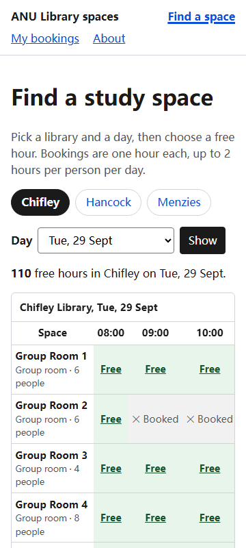

# ANU Library study-space booking

Book a group study room or a quiet seat in an ANU library by the hour, see at
a glance what is free right now, and cancel what you no longer need. One grid
per library per day: rooms down the side, hours across the top, every free
cell is a link that books it.

Live at <https://comp4020-crit7-hhhfff-hhhfff.fly.dev/>.

## Using it

1. **Find a space** — choose Chifley, Hancock or Menzies and a day. The grid
   marks every hour Free, Booked (✕) or Past.
2. **Book** — select a Free cell, enter your uID and name, press Book. You
   land on My bookings with a confirmation; if the slot was taken meanwhile or
   a rule stops you, you're sent back with the reason and nothing is saved.
3. **My bookings** — lists your upcoming bookings (your uID is remembered in
   a cookie) with a Cancel button for each; a cancelled hour is free again at
   once.

Keep the grid open in two tabs and book in one: the other tab's cell flips to
Booked without a reload.

There is no login: your uID is self-declared, so anyone who knows it could
cancel your booking. A real version would sign in through ANU's identity
system.

## What good looks like here

Finding a study room at ANU today means opening a separate booking system,
picking a library, then clicking through rooms to find a free hour. The thing
I wish existed is one page that answers "where can I sit at 2pm in Chifley?"
in a single glance and books it in one step.

Good, for this app, means:

- **Truthful availability.** The grid shows what the database holds, and a
  slot someone else has just taken disappears from every open grid without a
  reload.
- **No double bookings, ever.** Two people racing for the same room get one
  booking and one clear refusal. This is enforced by the database itself.
- **Fair rules, stated up front.** One-hour slots between 08:00 and 22:00
  Canberra time, up to 14 days ahead, at most 2 hours per person per day —
  the last two are ANU Library's own rules for group study rooms.
- **Honest refusals.** Every refused booking says why in plain English and
  changes nothing.
- **Works for everyone.** Every page works without JavaScript, by keyboard,
  on a phone, and never says "free" or "taken" by colour alone.
- **Private by default.** The grid says a room is Booked, never by whom; the
  live stream carries the slot, not the person.

### What I looked at

ANU Library's booking pages on LibCal and its "How do I book a group study
room?" answer: bookings by uID, up to two hours a day, up to two weeks ahead,
rooms listed with location, size and equipment. Chifley Library's 2026 trial
of bookable Level 2 computer desks and Level 3 study booths is why the app has
single seats as well as rooms, and the library's note that every room is
wheelchair accessible and has power outlets except the Hancock basement room
is carried into that room's features.

### What's real and what's illustrative

Real: the three library names, the 2-hour daily limit, the two-week window,
the Chifley desks and booths, the Hancock basement room. Illustrative: every
room number, capacity and equipment list, and the 08:00–22:00 hours (real
opening hours vary by library and teaching period).

### What I chose not to build

Sign-in (uID is self-declared, stated above), check-in codes and automatic
release of no-shows, extending a booking, multi-hour bookings in one step,
staff tools, and live occupancy sensors. Each is real in the library's
system; none is needed to show the one-glance grid working end to end.

### Enforced versus judgement

Enforced by the checks in `spec/`: every page passes the accessibility floor
(`invariants.test.ts`, with every page listed in `spec/routes.ts`); a booking
persists across a reload; a double booking, a third hour in a day, a past or
out-of-window slot, a malformed uID and an unknown space are refused with a
reason and book nothing; six simultaneous requests for one slot produce
exactly one booking; cancelling frees the slot and only the booker can
cancel; bookings and cancellations are broadcast live and never name the
booker; every grid cell states its status in words (`booking.test.ts`); the
rules hold in Canberra time whatever the server's clock (`rules.test.ts`).

Judgement, checked by hand in a browser: that the grid reads at a glance, that
it works at 360px wide with no sideways page scroll, that the live update
lands in a second open tab, and that keyboard focus is visible and starts at
the skip link.

## How it's built

Astro renders every page on the server from SQLite (Drizzle ORM) on one Fly
machine with one volume, so state survives reloads and redeploys. The schema
and the seeded spaces are migrations applied at boot. A unique index on
(space, date, hour) makes double booking impossible; the daily limit is
checked in the same transaction as the insert. Forms POST and the server
answers with a redirect, so nothing needs JavaScript; a small script
subscribes to a server-sent-events stream to keep an open grid live. The
rules the agent was held to are in `CLAUDE.md`.
